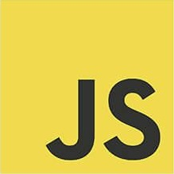

    *This is new to me...*

## My Thoughts on JavaScript so Far
JavaScript has existed long before I ever thought it did and it was created by people who were[are] much smarter I am. Before taking ICS 314 I know that the name "JavaScript" might have crossed my brain on occasion because I know that I have talked with people that use it on a daily basis. In fact, I am fairly certain that there were times where I made the easily assumed connection between JavaScript and Java. However, in terms of learning it or even becoming familiar with it, I have not even had the inkling before now. Prior to this most recent learning, I had dabbled in a few other languages (Java, C, C++), but mostly those were introductory at best and I had never created with them on my own for my own purposes. Based on that knowledge and the relatively small ammout of exposure that I have had to JavaScript thus far, I can say I like it the best. Yet, it is because of this lack of experience I can't comfortably say if this is a good language. The fact that most of the syntax does not seem to be quite so rigid is what I like the best. While I can appreciate a language that forces you to check each and every character that you type, a more of a free flowing feeling is a fresh change of pace. Especially in C it felt like the characters were all trying to get you.

In my ICS 314 class we had a module where we explored the JavaScript learning activities on [Free Code Camp](https://www.freecodecamp.com) . 

## My Thoughts on Athletic Software Engineering

