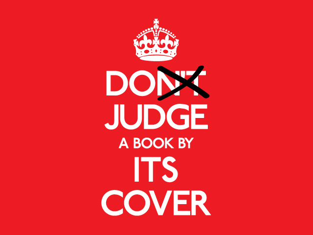

## What You See is What You Get

People as a whole are super simple. Initially we judge based on appearance and sometimes that is the only interaction we get. If something does not look good we have a tendency to not want to look at it anymore. As children we are taught to not judge a book by its cover or to look at people for what is on the inside. Yet with much of our modern media it is the exact opposite. A great example of this is a typical process while looking for a new app, something to kill some time. As you look into your respective app store you immediately judge every app based on what you see initially. Be it a screen shot or just a thumbnail. First impressions are everything and that is why it is so important to make it a great one.

## Seeing is Believing

Is this a bad thing? I do not think that it is. One could argue that it is more appealing to look at a beautiful landscape than it is to look at a landfill. While this argument is rather thin, it does show how much value we place on aesthetics. As humans we like things that are symmetrical, we like colors to match, we want to see things that we like. There are benefits to expecting more of what we see in every day life. If we raise the average level of basic design the overall experience online will improve. Right now there is are collections of older sites that have dated user interfaces that just don't look good. For their time they were fine. They were about putting information in a place that was accessable by many many people. But we've progessed pass that now. It is almost laughable how easy it is to publish something to the web so that anyone in the world with an internet connection might be able to see it. It is imperative that we hold everyone to at least a basic standard of design. 

## The Path

There are many frameworks out there, granted some of them are a bit to get into and some just don't make sense to everyone. But this is what we have right now. I feel that the next step is to make making a framework easy. Make a template of sorts that people can completely customize, or perhaps not a template. Maybe just a blank idea holder and people populate with their own pleasing themes. There would be a way to do a website or an application in a particular persons' style, and it would be easy. Yes there will be a collection of crap ones, but that's part of the learning process. That is how you push boundaries. You make a tool that people can explore with and see where they take it.
