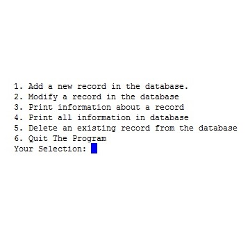

  

The purpose of this program was to create an address book made of record objects. The records would be inputted as a linked list and the contents of each record needed to be able to be modified. In addition, the contents of the list needed to be outputted onto a text file to use as a save file. This same save file would then be called upon at the next startup of the program and populate the list. 

This program was my introduction into C. Prior to this I had only used Java. I found the rigidity of C to somewhat welcoming. This project was actually a series of small homeworks that all came together about half way into the semester.This was by far the largest program that I had ever done. Throughout this project I had to write around a thousand lines of code and which included around a half dozen functions. 

Because of the nature of the class, there was already a structure for creating the project, and all I had to come up with was the code. I felt like this greatly challenged my understanding how code stores information as well as access it. 

[C Code](https://github.com/kclemmer/ICS212Project1)
