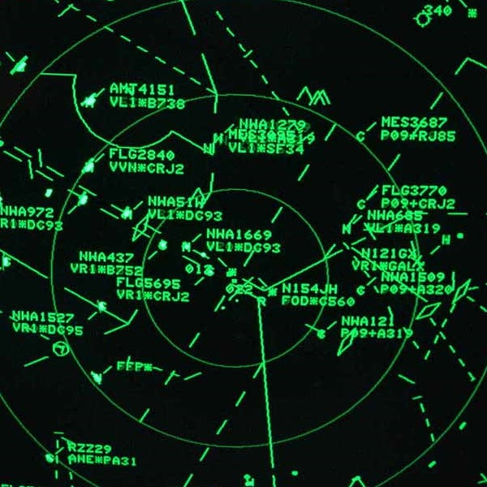

  

Most people have no idea what air traffic control is. There is a different culture among controllers than what any normal person would face. What they do is diffuclt. They have to keep track of every plane that they have been given control over and make sure that they dont hit any of the other planes. In addition to that, they have to keep each of the planes on the fastest route possibe, coordinating with other controllers in order to facilitate this. Not all controllers are created equal and as such the places that they work have various ratings in order to indicate the degree of difficulty that they face on a daily basis. 12 being the highest.

As a part of my military career I traveled the path of an Air Traffic Controller for a time. It was my first career and as such, straight out of basic, I went to tech school to learn the basics. At first the material is almost like a video game. They have you learn on simulators and most of what you are learning in the beginning is to get the words right. They have an encyclopedia with specific ways to say everything. From how to address planes to how to get them lined up for any sort of approach. 

