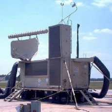

  

Radar technicians work on radars. You could have probably guessed that, but that statement barely scratches the surface of what those words mean. The school for being a radar technician in the military comes in three parts. Electronic Principles, Radar Fundamentals, and On the Job Training. They begin by introducing you to the world of electronics. This ranges from basic circuit diagrams to a cursory knowledge of networking. Radar Fundamentals explored the many different types of radar and the basic principles by which they operate. The phrase a radar is a radar is a radar was constantly repeated, but each new system looked more foreign than the last. Though that may have been because we kept looking at more and more recent systems as we progressed. It was interesting to see the way that radars have developed over the years. 

Radars work on a set of simple principals. The radar will transmit a propagate a signal into space via electromagnetism and focus it out at a particular bit of space in the sky. It will then listen for any shifted versions of the signal that it sent out and based on how the signal shifts, it determines what is out there in the sky. This information is then taken as the raw shifted signal and then is processed and displayed onto a screen by a rather simple principal. The longer it takes to get a response, the further out the object is. 

Within the radar itself there are a large number of checks that are performed regularly in order to ensure that everything is in working order. Performing these checks and then fixing any issues that arise is what a Radar Technician does. I am by no means an expert at this subject, but I have developed a comfortable level of proficiency within this system. Perhaps the most applicable aspect of this is the half-split method. That is to say in order to isolate a problem you perform a check somewhere in one half of the system. If the issue persists, then you continue on that half of the system. You continue to split your system in half by components and perform checks until you find the source of the problem. This method is similar to a binary sort. 
