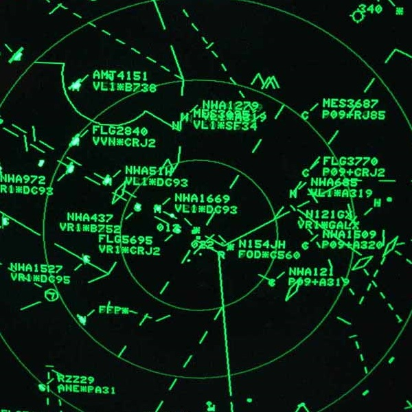

Most people have no idea what air traffic control is. There is a different culture among controllers than what any normal person would face. What they do is diffuclt. The stress level is rather high. They have to keep track of every plane that they have been given control over and make sure that they dont hit any of the other planes. In addition to that, they have to keep each of the planes on the fastest route possibe, coordinating with other controllers in order to facilitate this. Not all controllers are created equal and as such the places that they work have various ratings in order to indicate the degree of difficulty that they face on a daily basis. The highest rating a facility can have is 12. 

There aren't many references in pop culture to ATC, only two come to mind in fact. The first is an old movie from 1999, [Pushing Tin](http://www.imdb.com/title/tt0120797/). Not a bad movie, IMDB even gave it a 6.0/10.0, but defintely lesser known. The other reference is found in the hit series Breaking Bad. At the [end of season two](http://www.imdb.com/title/tt1232248/?ref_=ttep_ep13) there is an episode where it is a rather big plot point. Other than that, the profession is generally not mentioned. 

As a part of my military career I traveled the path of an Air Traffic Controller for a time. It was my first career and as such, straight out of basic, I went to tech school to learn how. The material was presented in two parts, the book learning and the simulators. There was a lot of history and technical data to memorize. Then they have you learn on simulators and most of what you are learning in the beginning is to get the words and phrases right. They have an encyclopedia with specific ways to say everything. From how to address planes to how to get them lined up for any sort of approach. It is an incredibly complex system which hinges mainly on memorization. But the real art of it is knowing what to say and when. It is this aspect of it that reminded me of a video game except it is played entirely with your words. You speak and they do, that is the contract in order to get them safely to their destinations. 

During this I had my share of learning experiences, I felt that I gained a significant amount through it all though. Through this experience I learned many things about myself including strengths and weaknesses. I know fully well what I am capable if and only if I apply myself. I also know where my limits are. This knowledge lets me know where I need to push in order to expand my horizons. The greatest takeaway from this experience is knowing that as I become more comfortable within a given subject, the quality of what I can output increases exponentially. 
