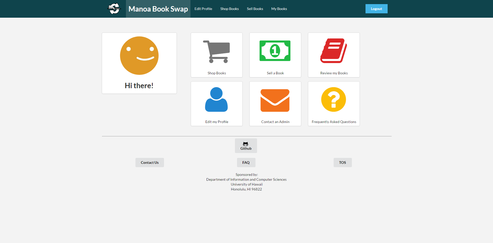
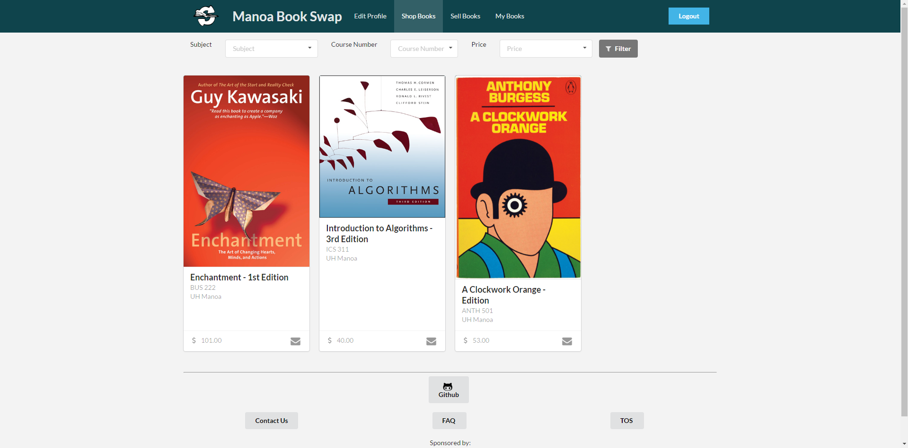

Buying and selling textbooks has always been an issue for students of every age. [Manoa Book Swap](https://manoabookswap.github.io/) hopes to solve this problem, at least within the UH System. Here students can come to exchange information so that they can buy and sell thier textbooks. It is a safe environment because it requires a UH Student account in order to access. The fact that people can't post anonymously helps to keep people accountable for their interactions. 

As a group project for ICS 314 we put this site together. We used the meteor framework to organize it and in order to implement the site we used Javascript, CSS, SemanticUI, and HTML5.

Below are some screenshots from the site. 

## Home Page

## Shop Books Page

For this project I put together the 'Contacts Us Page', the  'FAQ Page', and the walkthrough found on our documentation page. I can honestly say that I learned a lot from this project. It was the first time I worked in a group where we had a strong organization at the onset. Prior to this I have participated in a Game Jam and a Hackathon. But those are much more chaotic since you are working with a time constraint. I know how much more effective project based working can be and I look forward to any oportunities in the future to do so.
